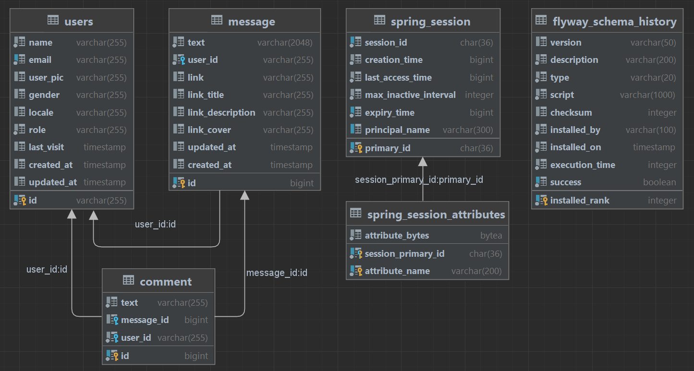
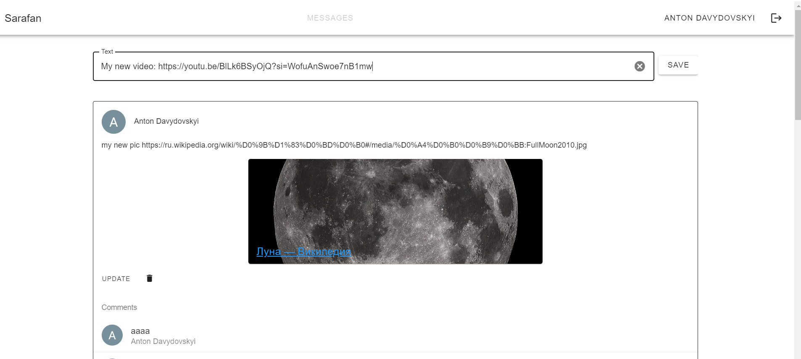
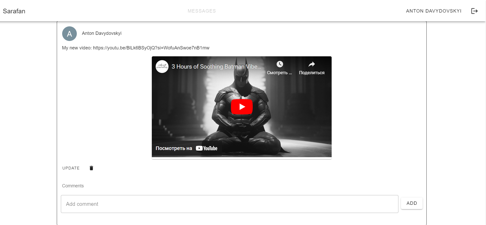
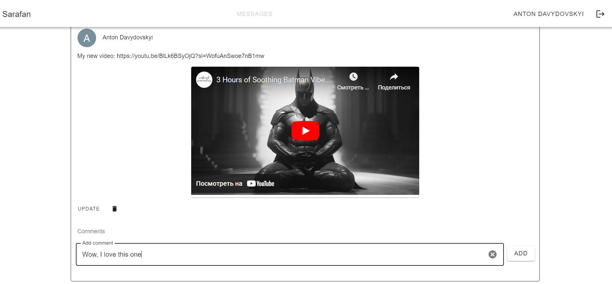
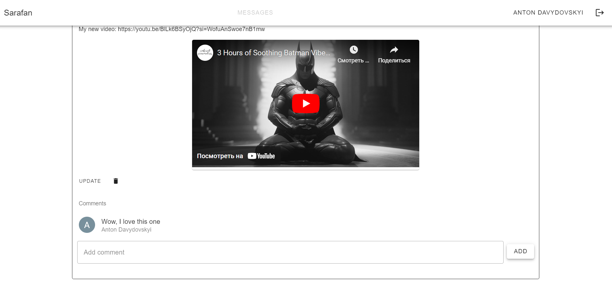

# Sarafan

*Social network like mini-mini Twitter.*

### Database Structure:

### Backend:

- Java 21
- Spring Boot 3
- Spring Web
- Spring Websocket
- Spring Security (Oauth2)
- Spring Data JPA
- Spring Session JDBC
- Thymeleaf
- PostgreSQL
- Flyway
- MapStruct

### Frontend:

- Vue 3.4.15
- Axios 1.6.7
- Vue-Router 4.2.5
- Vuetify 3.5.2
- Vuex 4.1.0

### Functionality:

- Login/Logout (Google)
- View all messages (Pagination + Sorting + Infinite scrolling)
- View profile
- Add/Delete/Update message
- Leave a comment under the message
- Preview of links on a site using microdata (Open Graph Protocol)

#### How it looks:

Click to expand

